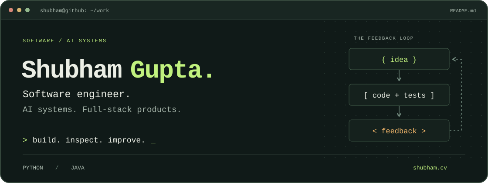

  <a href="https://shubham.cv"><strong>Portfolio</strong></a>
  &nbsp; / &nbsp;
  <a href="https://www.linkedin.com/in/shubhamgupta04907/"><strong>LinkedIn</strong></a>
  &nbsp; / &nbsp;
  <a href="https://www.gogethunt.com"><strong>HUNT</strong></a>
  &nbsp; / &nbsp;
  <a href="https://staffly-navy-psi.vercel.app"><strong>Staffly</strong></a>

## Hey, I'm Shubham.

I build software across **AI systems, backend infrastructure, and full-stack products**. My work ranges from agent evaluation and replay tools to the interfaces, APIs, and data models that make a product usable.

Previously worked with **WINNIIO / LifeAtlas** and **Stakrid**. Currently building **HUNT**, **Staffly**, **Chakra47**, and public tools for more dependable agents.

### Currently

Building **Azure integrations** and **agent evaluation tools**, and improving **inference efficiency**.

B.Tech in Computer Science (AI & ML) · Expected July 2027

## Products on the workbench

<table>
<tr>
<td width="50%" valign="top">

### 01 / HUNT

<code>EARLY ACCESS</code>

A workspace for overdue-invoice workflows, with configurable AI personas, invoice management, and conversation records.

**[Explore HUNT →](https://www.gogethunt.com)**

</td>
<td width="50%" valign="top">

### 02 / Staffly

<code>LIVE MVP</code>

AI-assisted staffing for Stockholm warehouse and logistics teams, with reviewed offers, timesheets, and document drafts. Next.js, Supabase PostgreSQL, and an Azure OpenAI assistant.

**[Explore Staffly →](https://staffly-navy-psi.vercel.app)**

</td>
</tr>
<tr>
<td colspan="2" valign="top">

### 03 / Chakra47

<code>IN DEVELOPMENT</code>

Apps for the physical world. Designing an application and management layer above existing Linux, RTOS, and robot controllers; the architecture is in development.

**[Explore the architecture →](https://www.chakra47.com/)**

</td>
</tr>
</table>

## Open the source

Tools I build to understand what an agent did, measure whether it worked, and make the next run better.

| Repository | The interesting part |
| :--- | :--- |
| **[Agent Eval Harness](https://github.com/kshubham090/Agent-Eval-Harness)** | Connect Codex, Claude Code, Python, command, or HTTP agents. Evaluate outputs and tool trajectories, preserve failures, and catch regressions in CI. |
| **[Contextual LLM Gateway](https://github.com/kshubham090/contextual-llm-gateway)** | Scoped pgvector + Neo4j memory, exact-response caching, durable graph updates, and bounded inference. Includes reproducible local embedding benchmarks. |
| **[Relogged](https://github.com/kshubham090/relogged)** | Record LangGraph runs, inspect traces without rerunning tools, then fork at a corrected tool result and resume live. |
| **[Chakra47 AgenticSwarm](https://github.com/kshubham090/Chakra47-AgenticSwarm)** | A separate public research project in governed multi-agent orchestration: deterministic rules, specialist agents, and tamper-evident decision trails. |
| **[FlexFit Studio](https://github.com/kshubham090/flexfit-studio)** | A full-stack refactoring and debugging exercise: typed domain services, transactional booking flows, and regression tests around credits, capacity, and cancellations. |

<strong>Research & experiments</strong>

### Research & evaluation

- **[VAYAS / Vyaskosh](https://github.com/kshubham090/vayas-kosh)** — An age-stratified Hindi speech-recognition audit, with sampling protocols, per-clip results, and speaker-level analysis. [Published preprint on Zenodo](https://doi.org/10.5281/zenodo.22176362). A second Vyaskosh manuscript is in progress.
- **[F1 lap-time & pit-stop prediction](https://github.com/kshubham090/f1-lap-time-pitstop-prediction)** — An XGBoost study examining evaluation leakage through grouped evaluation, SHAP explanations, and cross-season testing. [Published paper on Zenodo](https://doi.org/10.5281/zenodo.21862868).
- **[AI essay detector](https://github.com/kshubham090/ai-essay-detector)** — A local token-probability experiment with explicit false-positive, generator-confound, and hybrid-text analysis. The limitations are part of the result.

Presented the Chakra47 research project as **Symbiote-X at the India AI Impact Summit 2026**.

Code, methods, and reported results live alongside the projects. A useful experiment should show where the approach stops working, too.

## Under the hood

| Layer | Tools I work with |
| :--- | :--- |
| **Languages** | Python · TypeScript / JavaScript · Java · SQL · Bash |
| **Products & APIs** | React · Next.js · Node.js · Spring Boot · FastAPI · REST · tRPC |
| **Agents & ML** | LangGraph · LangChain · PyTorch · scikit-learn · Hugging Face · Codex · Claude Code |
| **Data & operations** | PostgreSQL · pgvector · Neo4j · Redis · Supabase · Docker · GitHub Actions |
| **Cloud** | Google Cloud · Microsoft Azure — currently going deeper on Azure |

<strong>Learning log</strong>

**Completed**

- Machine Learning Specialization — Stanford / Coursera
- Java Spring Framework 6 & Spring Boot 3 — Udemy
- Build and Secure Networks in Google Cloud — Google Cloud Skills Boost

**In progress**

- CUDA Python — NVIDIA DLI, 1 of 3 modules completed
- NVIDIA NCA-AIIO preparation
- Deeper work with Azure

<strong>One more thing: the contributions have a visitor.</strong>

Generated by the [workflow in this repository](./.github/workflows/snake.yml).

---

  <code>good questions → small experiments → working software</code> 
  <a href="https://shubham.cv">See the projects in context</a> · <a href="https://www.linkedin.com/in/shubhamgupta04907/">Say hello</a>

